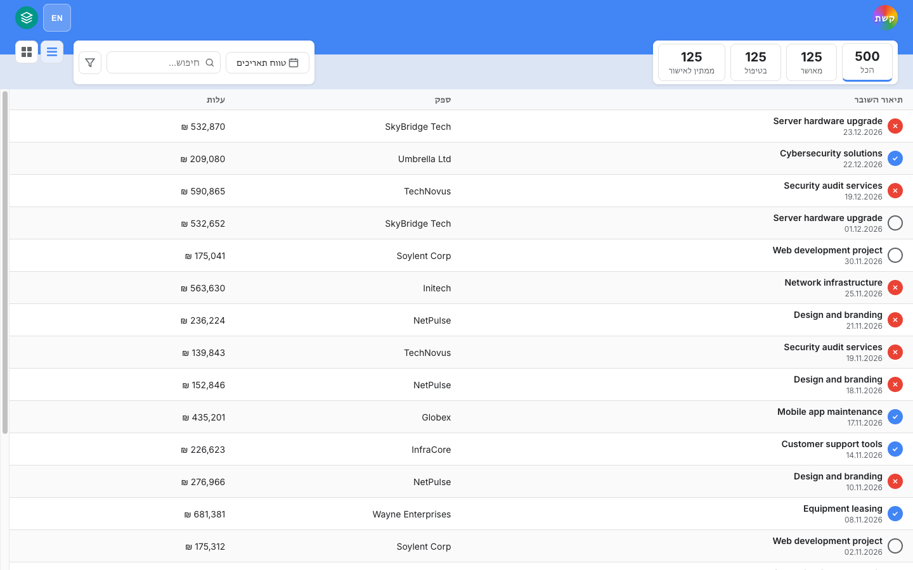
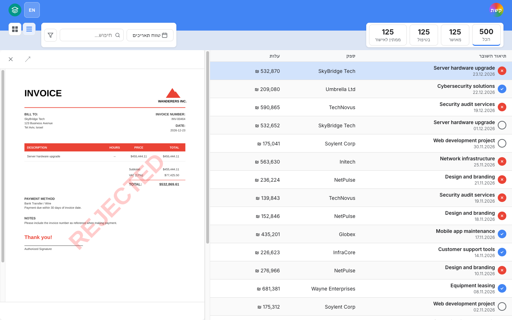
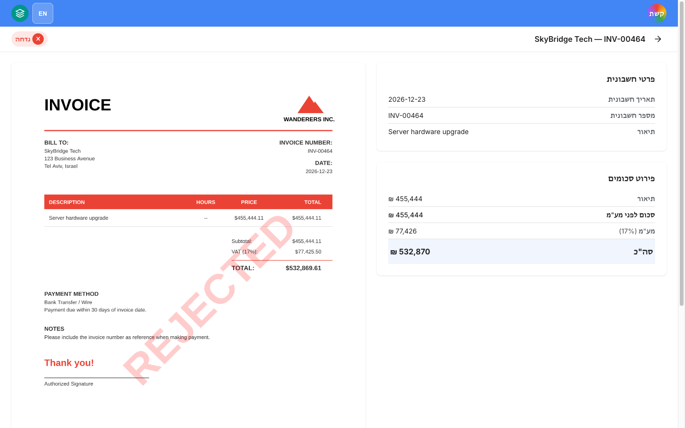
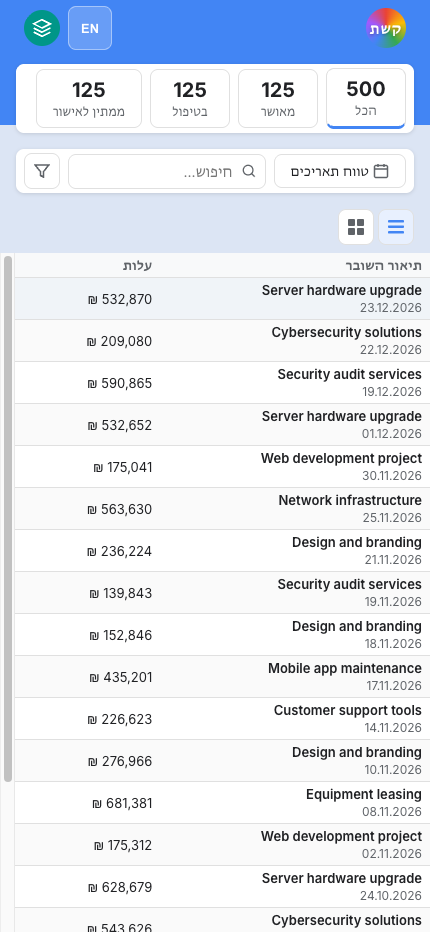
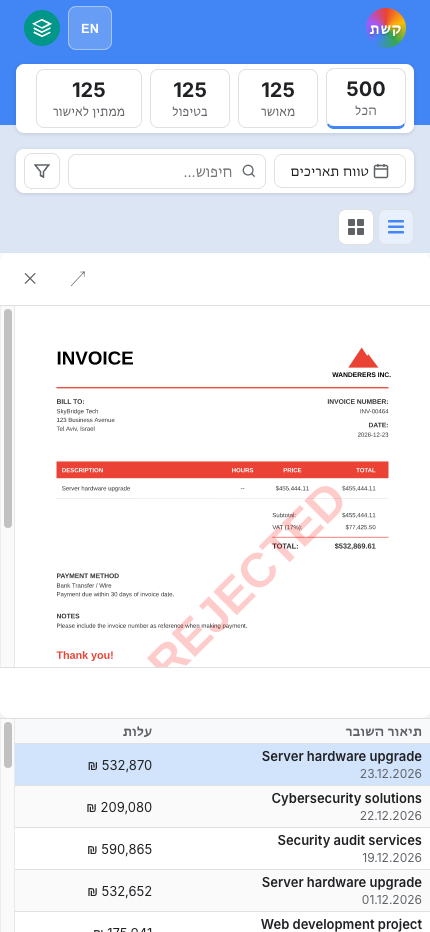
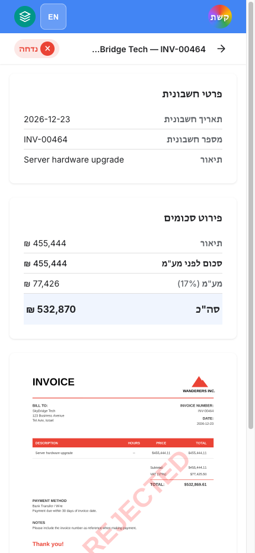

# Keshet (קשת) — Invoice Management System

A full-stack invoice management application built with Angular 21+ and NestJS 11, featuring real-time PDF preview, bilingual Hebrew/English support (RTL/LTR), and a fully accessible, mobile-responsive UI.

---

## Features

- **500 pre-seeded invoices** with randomized suppliers, amounts, and statuses
- **Real-time search** with debouncing across description and supplier
- **Status filtering** — All / Approved / In Process / Pending Approval
- **Date range picker** for filtering by issue date
- **Inline PDF preview** — click any row to open the invoice PDF in a side panel
- **Invoice detail view** — full-size PDF + structured breakdown cards
- **Infinite scroll** — seamlessly loads more invoices as you scroll
- **Bilingual** — Hebrew (RTL, default) and English (LTR) with runtime toggle
- **WCAG 2.1 AA accessible** — keyboard navigation, ARIA attributes, screen reader support
- **Mobile-responsive** — optimized layouts for desktop, tablet, and mobile
- **Redis caching** — server-side response caching with automatic invalidation
- **Circuit breaker** — Opossum-based fault tolerance on the backend
- **Docker** — multi-stage builds for both client (nginx) and server (Node)

---

## Tech Stack

| Layer     | Technology                                      |
|-----------|-------------------------------------------------|
| Frontend  | Angular 21+, Zoneless, Signals, OnPush          |
| Backend   | NestJS 11, TypeORM, SQLite (in-memory)          |
| PDF       | PDFKit (generation), pdf.js / pdfjs-dist (view) |
| Caching   | Redis via `@nestjs/cache-manager`               |
| Monorepo  | Nx workspace                                    |
| Deploy    | Docker + nginx                                  |

---

## Prerequisites

- Node.js 22+
- npm 10+
- Docker & Docker Compose (for containerized run)
- Redis (optional — falls back to in-memory cache if unavailable)

---

## Installation & Development

```bash
# Clone the repository
git clone <repo-url>
cd keshet

# Install dependencies
npm install

# Start the backend (port 3000)
npx nx serve server

# Start the frontend (port 4200) — in a separate terminal
npx nx serve client
```

Open [http://localhost:4200](http://localhost:4200) in your browser.

> The backend seeds 500 invoices and generates their PDFs on first startup. This may take a few seconds.

---

## Running with Docker

```bash
# Build and start all services (client, server, redis)
docker-compose up --build
```

| Service | URL                       |
|---------|---------------------------|
| Client  | http://localhost:4200     |
| Server  | http://localhost:3000/api |
| Redis   | localhost:6379            |

---

## API Endpoints

| Method | Path                          | Description                        |
|--------|-------------------------------|------------------------------------|
| GET    | `/api/invoices`               | Paginated list (search, status, date range) |
| GET    | `/api/invoices/status-counts` | Count by status                    |
| GET    | `/api/invoices/:id`           | Single invoice detail              |
| GET    | `/api/files/:id`              | Stream PDF (generated via PDFKit)  |
| GET    | `/health`                     | Readiness check                    |
| GET    | `/health/live`                | Liveness check                     |

Query parameters for `/api/invoices`: `page`, `pageSize`, `search`, `status`, `dateFrom`, `dateTo`

---

## Testing

```bash
# Backend unit tests
npx nx test server

# Frontend unit tests
npx nx test client

# With coverage
npx nx test server --coverage
npx nx test client --coverage

# Backend E2E (Supertest)
npx nx test server --testPathPattern=e2e
```

Coverage target: **80% lines** for both backend and frontend.

---

## Project Structure

```
keshet/
├── apps/
│   ├── client/                  # Angular 21+ frontend
│   │   └── src/app/
│   │       ├── core/            # Services, interceptors, pipes
│   │       ├── features/
│   │       │   ├── invoice-list/    # Screen 1: list + PDF panel
│   │       │   └── invoice-detail/  # Screen 2: detail view
│   │       └── shared/          # Header, PDF viewer, status pill, toast
│   └── server/                  # NestJS 11 backend
│       └── src/
│           ├── invoice/         # Invoice module (Clean Architecture)
│           │   ├── domain/
│           │   ├── application/
│           │   ├── infrastructure/
│           │   └── presentation/
│           ├── file-storage/    # PDF storage + generation module
│           ├── health/          # Health check endpoints
│           └── common/          # Filters, interceptors, DTOs
└── libs/
    └── shared/                  # Shared types (InvoiceStatus, etc.)
```

---

## Screenshots

### Desktop

#### Invoice List
The main screen with the full invoice table, status filter counts, search bar, and date range picker. Defaults to Hebrew RTL layout.



---

#### Invoice List + PDF Preview
Clicking any row opens an inline PDF side panel (40% width) showing the rendered invoice with a REJECTED watermark where applicable.



---

#### Invoice Detail
Double-clicking a row navigates to the detail screen: full-size PDF viewer on the left, invoice info and amount breakdown cards on the right.



---

### Mobile (430px)

#### Invoice List
On mobile, the supplier column is hidden and status count boxes scroll horizontally. The controls bar stacks vertically.



---

#### Invoice List + PDF Preview
On mobile, the PDF panel renders above the table (stacked layout) for easy scroll-through viewing.



---

#### Invoice Detail
Detail screen on mobile: info cards appear above the PDF viewer in a single-column layout.



---

## Responsive Breakpoints

| Breakpoint | Behavior                                                     |
|------------|--------------------------------------------------------------|
| > 1024px   | Full two-column layout (list + PDF panel side by side)       |
| ≤ 1024px   | PDF panel takes 50% width                                    |
| ≤ 768px    | Stacked layout, supplier column hidden, date picker as fixed bottom sheet |
| ≤ 480px    | Status icon column hidden                                    |

---

## Accessibility

- Skip-navigation link (visible on focus)
- Full keyboard navigation (Tab, Enter, Space, Escape)
- ARIA landmarks: `banner`, `main`, `navigation`
- `aria-selected`, `aria-pressed`, `aria-expanded` on interactive controls
- Screen reader announcements for loading, errors, and toasts
- WCAG 2.1 AA color contrast
- `prefers-contrast: more` support
- Touch targets minimum 44×44px

---

## Environment Variables

| Variable    | Default                  | Description               |
|-------------|--------------------------|---------------------------|
| `PORT`      | `3000`                   | Backend HTTP port         |
| `REDIS_URL` | *(in-memory fallback)*   | Redis connection URL      |
